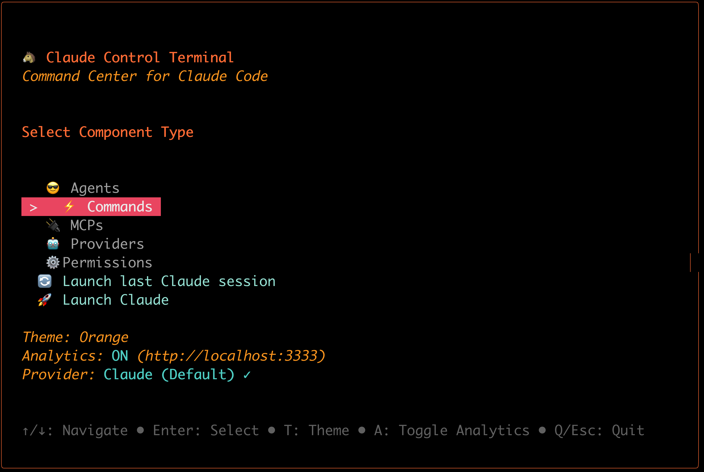
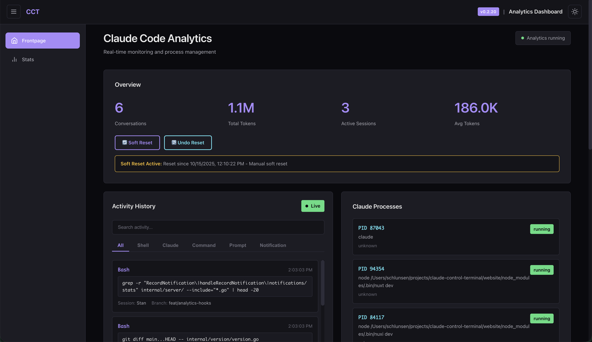

# Claude Control Terminal (CCT)

[](https://go.dev/)
[](https://opensource.org/licenses/MIT)
[](https://github.com/schlunsen/claude-control-terminal/actions)
[](https://github.com/schlunsen/claude-control-terminal)
[](https://github.com/schlunsen/claude-control-terminal/releases)

**A powerful wrapper and control center for Claude Code** - Manage components, configure AI providers, control permissions, launch Claude, run analytics, and deploy with Docker.

## 🎬 Watch the Demo

<p align="center">
  <a href="https://www.youtube.com/watch?v=iT4Oo3diySg">
    
  </a>
  <br>
  <em>▶️ Click to watch the full demo on YouTube</em>
</p>

Rebranded from `go-claude-templates` to better reflect its role as a comprehensive control terminal for Claude Code environments.

**Performance**: 50x faster startup, 5x lower memory usage, single 15MB binary with no dependencies.

<p align="center">
  
</p>

<p align="center">
  
  
</p>

## Table of Contents

- [Features](#features)
- [Installation](#installation)
- [Claude CLI Installation](#claude-cli-installation)
- [Quick Start](#quick-start)
- [Component Installation](#component-installation)
- [AI Provider Configuration](#ai-provider-configuration)
- [Permissions Management](#permissions-management)
- [Docker Support](#docker-support)
- [Analytics Dashboard](#analytics-dashboard)
- [Documentation](#documentation)
- [Development](#development)
- [License](#license)

## Features

- 🎮 **Control Center**: Comprehensive wrapper for managing Claude Code environments
- 🤖 **Claude CLI Installer**: Automatic installation and setup of Claude CLI (no Node.js required)
- 🚀 **Interactive TUI**: Modern terminal interface for browsing and installing components
- 📦 **Component Management**: Install agents, commands, and MCPs from 600+ templates
- 🔄 **AI Provider Configuration**: Switch between Claude, DeepSeek, GLM, Kimi, and custom providers
- ⚙️ **Permissions Management**: Granular control over Claude Code tool permissions (global/project/local)
- 🐳 **Docker Support**: Containerize Claude environments with one command
- 📊 **Analytics Dashboard**: Real-time WebSocket-based monitoring with process correlation
- ⚡ **High Performance**: 50-100x faster than Node.js version, 5x lower memory
- 🔧 **Zero Dependencies**: Single 15MB self-contained binary
- 🌐 **Cross-Platform**: Linux, macOS, Windows (amd64/arm64)

## Installation

### Option 1: Homebrew (macOS/Linux)

```bash
# Tap and install
brew tap schlunsen/cct
brew install cct

# Or one-line installation
brew install schlunsen/cct/cct
```

### Option 2: Download Binary

```bash
# Download for your platform from releases
curl -L https://github.com/schlunsen/claude-control-terminal/releases/latest/download/cct-<platform>-<arch> -o cct
chmod +x cct
sudo mv cct /usr/local/bin/
```

### Option 3: Install with Go

```bash
go install github.com/schlunsen/claude-control-terminal/cmd/cct@latest
```

### Option 4: Build from Source

```bash
git clone https://github.com/schlunsen/claude-control-terminal
cd claude-control-terminal
make build  # or: just build
```

## Claude CLI Installation

CCT includes an automatic Claude CLI installer for quick setup.

### Automatic Installation

```bash
# Install Claude CLI automatically (interactive)
cct --install-claude

# The installer will:
# ✓ Check if Claude is already installed
# ✓ Detect your Node.js version (if using npm method)
# ✓ Recommend the best installation method
# ✓ Download and install Claude CLI
# ✓ Verify installation with 'claude doctor'
```

### Installation Methods

CCT supports two installation methods:

**Native Binary (Recommended)**:
- No Node.js required
- Faster startup times
- Official installation method
- Automatically maintained
- Works on macOS, Linux, and Windows

**NPM Installation (Fallback)**:
- Requires Node.js v18+
- Uses `npm install -g @anthropic-ai/claude-code`
- Available if native method fails

### Manual Installation

If you prefer to install Claude CLI manually:

**macOS/Linux (Native)**:
```bash
curl -fsSL https://claude.ai/install.sh | bash
```

**Windows (PowerShell)**:
```powershell
irm https://claude.ai/install.ps1 | iex
```

**NPM (All Platforms)**:
```bash
npm install -g @anthropic-ai/claude-code
```

### Verification

After installation, verify Claude CLI is working:

```bash
claude --version
claude doctor
```

## Quick Start

### Interactive TUI (Recommended)

Launch the interactive Terminal User Interface to browse and install components:

```bash
# Run without arguments to launch TUI
cct

# Or with custom directory
cct -d ~/my-project
```

**Features**:
- Browse 600+ agents, 200+ commands, and MCPs
- Configure AI providers (Claude, DeepSeek, GLM, Kimi, Custom)
- Manage Claude Code permissions (Global/Project/Local)
- Real-time search and filtering
- Installation status indicators ([G]=Global, [P]=Project)
- Modern, hip terminal aesthetic
- Keyboard-driven interface
- Launch Claude CLI directly from TUI

[View TUI Guide](docs/TUI_GUIDE.md) | [View Screenshots](docs/TUI_SCREENS.md)

### CLI Flags (For Automation)

```bash
# Install components with smart category search
cct --agent api-documenter
cct --agent prompt-engineer --command security-audit --mcp postgresql

# Multiple components at once
cct --agent "api-documenter,database-architect" \
    --command "security-audit,setup-linting" \
    --mcp "postgresql,supabase"

# Launch analytics dashboard
cct --analytics
# Open browser to http://localhost:3333

# Get help
cct --help
cct --version
```

## Component Installation

The CLI automatically searches through all component categories to find what you need. No need to specify full paths.

### Agents (600+ templates across 25+ categories)

```bash
cct --agent api-documenter        # Found in documentation/
cct --agent prompt-engineer       # Found in ai-specialists/
cct --agent database-architect    # Found in database/
cct --agent git-flow-manager      # Found in git/
```

**Categories**: ai-specialists, api-graphql, blockchain-web3, business-marketing, data-ai, database, development-tools, devops-infrastructure, documentation, git, mcp-dev-team, performance-testing, programming-languages, security, and more.

### Commands (200+ templates across 19+ categories)

```bash
cct --command security-audit      # Found in security/
cct --command setup-linting       # Found in setup/
cct --command deploy-production   # Found in deployment/
```

**Categories**: automation, database, deployment, documentation, git, performance, project-management, security, setup, testing, utilities, and more.

### MCPs (Server integrations across 9+ categories)

```bash
cct --mcp postgresql              # Found in database/
cct --mcp supabase                # Found in database/
cct --mcp github                  # Found in integration/
```

**Categories**: browser_automation, database, devtools, filesystem, integration, marketing, productivity, web.

### Custom Installation Directory

```bash
cct --agent api-documenter --directory ~/my-project
```

## AI Provider Configuration

CCT allows you to configure and switch between different AI providers that support Anthropic-compatible APIs. This enables you to use Claude Code with alternative AI services.

### Supported Providers

| Provider | Models | Description |
|----------|--------|-------------|
| **Claude (Default)** | claude-sonnet-4.5, claude-opus-4.1, claude-3-5-sonnet, etc. | Official Anthropic Claude models |
| **DeepSeek** | deepseek-chat, deepseek-reasoner | DeepSeek AI with Anthropic compatibility |
| **GLM (Z.ai)** | GLM-4.6, GLM-4.5-Air | Zhipu AI GLM models via Z.ai |
| **Kimi** | kimi-k2, moonshot-v1-128k | Moonshot AI Kimi models |
| **Custom** | Your custom model | Any Anthropic-compatible API endpoint |

### Configuration via TUI

Launch the interactive TUI and navigate to "Providers":

```bash
cct
# Select "Providers" from main menu
```

**Features**:
- 🔄 **Persistent Storage**: API keys and configurations saved in SQLite database
- 🎯 **Model Selection**: Choose specific models for each provider
- 📝 **Custom Providers**: Add any Anthropic-compatible API endpoint
- 💾 **Multi-Provider Support**: Store configurations for all providers, switch anytime
- 📱 **Compact Mode**: Responsive UI works even in small terminal windows

### How It Works

When you configure a provider, CCT:

1. **Saves Configuration**: Stores API key, base URL, and model in `~/.claude/cct_history.db`
2. **Generates Script**: Creates `~/.claude/provider-env.sh` with environment variables
3. **Sets Variables**: Exports `ANTHROPIC_AUTH_TOKEN`, `ANTHROPIC_BASE_URL`, and `ANTHROPIC_MODEL`

### Using the Configuration

After configuring a provider, source the generated script:

```bash
# Load provider configuration
source ~/.claude/provider-env.sh

# Now launch Claude Code with the configured provider
claude
```

**Optional**: Add to your shell profile for automatic loading:

```bash
# For bash
echo 'source ~/.claude/provider-env.sh' >> ~/.bashrc

# For zsh
echo 'source ~/.claude/provider-env.sh' >> ~/.zshrc
```

### Custom Provider Example

For custom Anthropic-compatible APIs:

1. Select "Custom" provider in TUI
2. Enter your API key
3. Enter base URL (e.g., `https://api.example.com/v1/anthropic`)
4. Optionally specify model name (e.g., `claude-3-5-sonnet-20241022`)
5. Save configuration

### Switching Providers

Simply return to the Providers screen and select a different provider. Your previous configurations are preserved, so you can switch back anytime without re-entering credentials.

## Permissions Management

CCT provides a powerful interface for managing Claude Code tool permissions across three levels: Global, Project, and Local settings.

### Permission Levels

| Level | Scope | Location | Priority |
|-------|-------|----------|----------|
| **Global** | All projects system-wide | `~/.config/claude/settings.json` | Lowest |
| **Project** | Current project directory | `.claude/settings.json` (gitignored) | Medium |
| **Local** | Current project (committed) | `.claude/settings.local.json` | Highest |

### Configuration via TUI

Launch the interactive TUI and navigate to "Permissions":

```bash
cct
# Select "Permissions" from main menu
```

**Features**:
- 📑 **Tabbed Interface**: Switch between Global, Project, and Local settings
- ✅ **Visual Status**: See which permissions are enabled at each level
- 🔍 **Permission Categories**: Organized by tool type (Bash, Read, Write, etc.)
- ➕ **Add Custom Permissions**: Define your own permission rules
- 💾 **Multi-Source View**: See combined permission state across all levels

### Permission Categories

The TUI organizes permissions by tool type:

- **Bash Commands**: `git`, `npm`, `docker`, etc.
- **File Operations**: Read, Write, Edit permissions with glob patterns
- **Web Access**: WebFetch, WebSearch domains
- **Custom Patterns**: Define your own permission rules

### How Permissions Work

1. **Priority System**: Local > Project > Global (higher priority wins)
2. **Additive**: Permissions from all levels are combined
3. **Pattern Matching**: Supports glob patterns (`*.js`, `/path/**`)
4. **Automatic Approval**: Tools matching approved patterns don't require manual approval

### Example: Configuring Git Permissions

1. Navigate to Permissions → Global tab
2. Find "Git Commands" category
3. Enable `Bash(git:*)` for all git commands
4. Save configuration
5. Claude Code will now auto-approve all git operations

### Example: Custom Permission Rules

Add custom permissions for your workflow:

```
Bash(npm:*)           # Auto-approve all npm commands
Read(/src/**)         # Allow reading all files in src/
Write(/docs/*.md)     # Allow writing markdown in docs/
WebFetch(domain:*.github.com)  # Allow fetching from GitHub
```

### Best Practices

- ✅ **Use Global** for universal tools (git, npm)
- ✅ **Use Project** for project-specific needs (gitignored, not committed)
- ✅ **Use Local** for team-shared permissions (committed to repo)
- ⚠️ **Be Specific** with Write permissions to prevent accidental file modifications
- 🔒 **Review Regularly** to ensure security and appropriate access levels

## Docker Support

CCT provides comprehensive Docker support for containerizing Claude Code environments.

### Quick Start with Docker

```bash
# Generate Dockerfile and .dockerignore
cct --docker-init --docker-type claude

# Build Docker image
cct --docker-build

# Run containerized Claude environment
cct --docker-run

# View logs
cct --docker-logs

# Stop container
cct --docker-stop
```

### Docker Compose

Generate multi-service setups with docker-compose:

```bash
# Generate docker-compose.yml for Claude + Analytics
cct --docker-compose --docker-type analytics

# Generate full stack (Claude + Analytics + PostgreSQL + Redis)
cct --docker-compose --docker-type full

# Start services
docker-compose up -d
```

### Dockerfile Types

CCT can generate 4 types of Dockerfiles:

| Type | Description | Use Case |
|------|-------------|----------|
| `base` | Minimal CCT-only image | Lightweight component management |
| `claude` | Full Claude environment (Node.js + Claude CLI + CCT) | Complete development setup |
| `analytics` | Optimized for analytics dashboard | Monitoring and metrics |
| `full` | Complete dev environment with all tools | Production-ready setup |

### Docker Compose Templates

| Template | Services | Use Case |
|----------|----------|----------|
| `simple` | Claude + CCT | Basic containerized development |
| `analytics` | Claude + Analytics dashboard | Real-time monitoring |
| `database` | Claude + PostgreSQL | Database-backed projects |
| `full` | Claude + Analytics + PostgreSQL + Redis | Complete production stack |

### Include MCPs in Containers

```bash
# Generate Dockerfile with specific MCPs
cct --docker-init --docker-type claude --docker-mcps "postgresql,github,supabase"

# Generate docker-compose with MCPs
cct --docker-compose --docker-type full --docker-mcps "postgresql,github"
```

### Docker Examples

**Example 1: Simple Development Container**
```bash
# Initialize Docker files
cct --docker-init --docker-type claude

# Build and run
cct --docker-build
cct --docker-run --docker-command "claude"
```

**Example 2: Analytics Dashboard in Docker**
```bash
# Generate analytics-optimized setup
cct --docker-init --docker-type analytics
cct --docker-build
cct --docker-run --docker-command "cct --analytics"

# Access dashboard at https://localhost:3333 (HTTPS enabled)
```

**Example 3: Full Stack with Docker Compose**
```bash
# Generate complete stack
cct --docker-compose --docker-type full --docker-mcps "postgresql,redis"

# Configure environment
cp .env.example .env
# Edit .env with your API keys

# Start all services
docker-compose up -d

# Access Claude: docker-compose exec claude claude
# Access Analytics: https://localhost:3333 (HTTPS enabled)
```

## Analytics Dashboard

Real-time monitoring of Claude Code conversations with WebSocket live updates, secured with HTTPS and API key authentication.

```bash
cct --analytics
# Dashboard available at https://localhost:3333 (HTTPS enabled by default)
# API key automatically generated in ~/.claude/analytics/.secret
```

<p align="center">
  
</p>

### Features

- **Secure by Default**: HTTPS encryption + API key authentication
- Real-time conversation monitoring with WebSocket (WSS) updates
- State detection: "Claude Code working...", "Awaiting user input...", etc.
- Process correlation with running Claude Code instances
- System statistics: active conversations, total messages, state distribution
- Auto-refresh every 30 seconds plus instant WebSocket updates
- Responsive purple-themed gradient UI

### Security Features

**Automatic Setup (First Run)**:
- Self-signed TLS certificate generated in `~/.claude/analytics/certs/`
- API key generated in `~/.claude/analytics/.secret`
- Server binds to `127.0.0.1` (localhost-only) by default
- Hooks automatically configured to use HTTPS and API key

**Configuration**: Edit `~/.claude/analytics/config.json` to customize TLS, authentication, CORS, and server settings.

**For more details**, see the [Security Features section in CLAUDE.md](CLAUDE.md#security-features).

### API Endpoints

**Note**: All endpoints use HTTPS. GET requests don't require authentication. POST/DELETE require API key via `Authorization: Bearer <key>` header.

- `GET /api/health` - Health check
- `GET /api/data` - Complete conversation data
- `GET /api/conversations` - Conversation list with metadata
- `GET /api/processes` - Running Claude Code processes
- `GET /api/stats` - System statistics and metrics
- `POST /api/refresh` - Force data refresh (requires auth)
- `POST /api/reset/soft` - Soft reset with delta tracking (requires auth)
- `POST /api/reset/archive` - Archive all conversations (requires auth)
- `POST /api/reset/clear` - Permanently delete all conversations (requires auth)
- `DELETE /api/reset` - Clear soft reset and restore original counts (requires auth)
- `GET /api/reset/status` - Get current reset status
- `GET /wss` - WebSocket connection for real-time updates (secure WebSocket)

**Example API calls**:
```bash
# GET requests work without auth (use -k for self-signed cert)
curl -k https://localhost:3333/api/data

# POST requests require API key
API_KEY=$(cat ~/.claude/analytics/.secret)
curl -X POST https://localhost:3333/api/refresh \
  -H "Authorization: Bearer $API_KEY" \
  -k
```

### Resetting Analytics Counts

You can reset the analytics counts in three ways:

**Option 1: Soft Reset (Recommended) - Delta-Based** 🔄
```bash
# Get your API key
API_KEY=$(cat ~/.claude/analytics/.secret)

# Resets counts to zero without deleting any data (reversible)
curl -X POST https://localhost:3333/api/reset/soft \
  -H "Authorization: Bearer $API_KEY" \
  -k
```
This applies a delta to make counts appear as if you're starting from zero, while preserving all conversation data. Perfect for tracking usage from a specific date. You can undo this anytime:
```bash
# Restore original counts
curl -X DELETE https://localhost:3333/api/reset \
  -H "Authorization: Bearer $API_KEY" \
  -k
```

**Option 2: Archive** 📦
```bash
# Archives all conversations to timestamped folder, preserving data
curl -X POST https://localhost:3333/api/reset/archive \
  -H "Authorization: Bearer $API_KEY" \
  -k
```
This moves all `.jsonl` files to `~/.claude/archive/YYYY-MM-DD_HH-MM-SS/`, allowing you to recover them later.

**Option 3: Clear (Permanent)** ⚠️
```bash
# Permanently deletes all conversation files
curl -X POST https://localhost:3333/api/reset/clear \
  -H "Authorization: Bearer $API_KEY" \
  -k
```
This permanently removes all `.jsonl` files (cannot be undone!).

**Using the UI**
The analytics dashboard includes intuitive reset buttons for all three options. Just click the "🔄 Soft Reset" button (recommended) or choose another option. When a soft reset is active, you'll see a yellow banner with reset details and a "Restore Original Counts" button.

## Documentation

- [TUI User Guide (docs/TUI_GUIDE.md)](docs/TUI_GUIDE.md) - Interactive interface guide and keyboard shortcuts
- [TUI Screen Flow (docs/TUI_SCREENS.md)](docs/TUI_SCREENS.md) - Visual documentation of all TUI screens
- [TUI Developer Guide (docs/TUI_DEVELOPER_GUIDE.md)](docs/TUI_DEVELOPER_GUIDE.md) - Technical implementation details
- [Development Guide (CLAUDE.md)](CLAUDE.md) - Architecture, development workflow, and best practices
- [Testing Guide (TESTING.md)](TESTING.md) - Comprehensive testing instructions and examples
- [Changelog (CHANGELOG.md)](CHANGELOG.md) - Version history and migration details
- [Contributing (CONTRIBUTING.md)](CONTRIBUTING.md) - How to contribute to the project

## Development

### Build Commands

```bash
# Build for current platform
make build      # or: just build

# Build for all platforms (Linux, macOS, Windows)
make build-all  # or: just build-all

# Run directly
make run        # or: just run

# Run analytics dashboard
make run-analytics  # or: just analytics

# Clean build artifacts
make clean      # or: just clean
```

### Tech Stack

- **Language**: Go 1.23+ (using go1.24.8 toolchain)
- **CLI**: Cobra (commands), Pterm (terminal UI)
- **TUI**: Bubble Tea (interactive interface), Lipgloss (styling), Bubbles (components)
- **Web**: Fiber v2 (HTTP server), Gorilla WebSocket
- **Docker**: Native Docker SDK integration
- **System**: fsnotify (file watching), gopsutil (process detection)

### Testing

CCT includes comprehensive automated testing with coverage reports:

```bash
# Run all tests
make test

# Run tests with verbose output and race detector
make test-verbose

# Generate coverage report
make test-coverage

# Open coverage report in browser
make test-coverage-html

# Generate coverage badge URL
make coverage-badge

# Quick automated integration tests
./TEST_QUICK.sh        # 7 tests
./TEST_CATEGORIES.sh   # 9 category search tests
```

**Automated Testing:**
- Comprehensive unit tests for analytics, components, docker, fileops, providers, server, cmd, and tui packages
- Daily scheduled test runs at 8:00 AM UTC via GitHub Actions
- Multi-platform testing (Linux, macOS, Windows)
- Multi-version Go testing (1.23, 1.24)
- Coverage reports with Codecov integration
- Coverage threshold enforcement (20% minimum)

**Current Coverage:** 28.8% total, 30.7% filtered (2,300+ lines of test code across 8 packages)

For detailed testing guide, see [TESTING.md](TESTING.md).
For coverage analysis and improvement roadmap, see [COVERAGE.md](COVERAGE.md).

For detailed development setup, architecture documentation, and contribution guidelines, see [CONTRIBUTING.md](CONTRIBUTING.md) and [CLAUDE.md](CLAUDE.md).

## Migration from go-claude-templates

If you're upgrading from the previous `go-claude-templates`:

**Module Path Changed:**
- Old: `github.com/davila7/go-claude-templates`
- New: `github.com/schlunsen/claude-control-terminal`

**What's New in v0.2.0:**
- Rebranded to Claude Control Terminal (CCT)
- Full Docker support with 4 Dockerfile types
- Docker Compose templates for multi-service setups
- MCP integration in containers
- Enhanced TUI with installation status indicators
- Improved positioning as control center for Claude Code

**Breaking Changes:**
- Import paths must be updated if using CCT as a library
- Binary name remains `cct` (no change needed for CLI users)

## License

MIT License - See [LICENSE](LICENSE) file for details.

Based on [claude-code-templates](https://github.com/davila7/claude-code-templates) by davila7.
